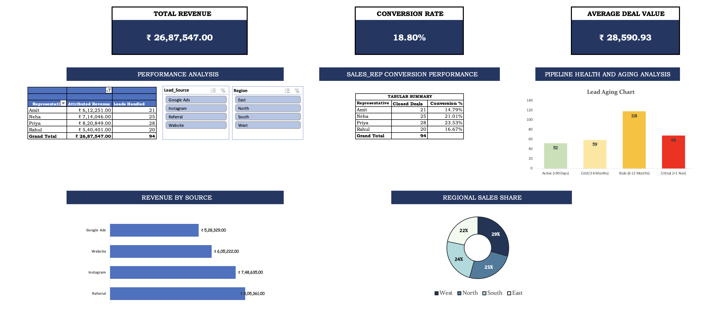

# Sales Pipeline & Performance Tracker

## Dashboard Preview

## Project Overview
This project is an end-to-end Lead Management system designed to track conversion efficiency and pipeline health across the sales lifecycle. It monitors key metrics like individual representative performance and lead attribution to provide accurate ROI reporting across acquisition channels.

## Key Technical Features
* **Pipeline Health & Aging Analysis:** Developed a visual tracking system to categorize leads by age (Active, Cold, Stale, Critical), enabling data-driven prioritization for follow-up strategies.
* **Conversion Analytics:** Tracks a stabilized overall conversion benchmark of **18.80%** across the team, with granular tracking of individual rep conversion rates ranging from 14.79% to 23.53%.
* **Attributed Revenue Tracking:** Successfully reconciled a total revenue of **₹26,87,547.00** back to specific sources such as Instagram, Google Ads, and Referrals.
* **Performance Benchmarking:** Calculates an Average Deal Value of **₹28,590.93** to assess deal quality and representative efficiency.

## Tools & Technical Stack
* **Platform:** Microsoft Excel for the Web.
* **Data Modeling:** Pivot Table Tabular Summaries for real-time performance analysis.
* **Interactive Visualization:** Integrated Slicers for Lead Source and Regional filtering.
* **Categorical Logic:** Multi-layered charting including Revenue by Source (Bar) and Regional Sales Share (Doughnut).
